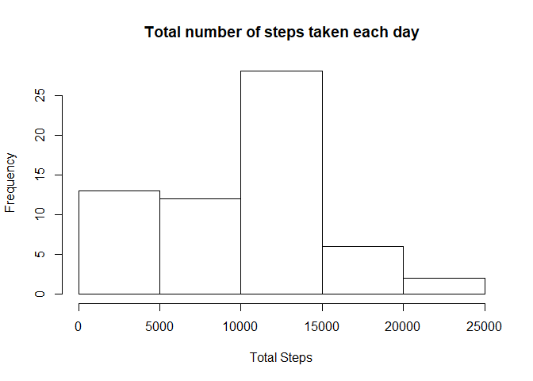
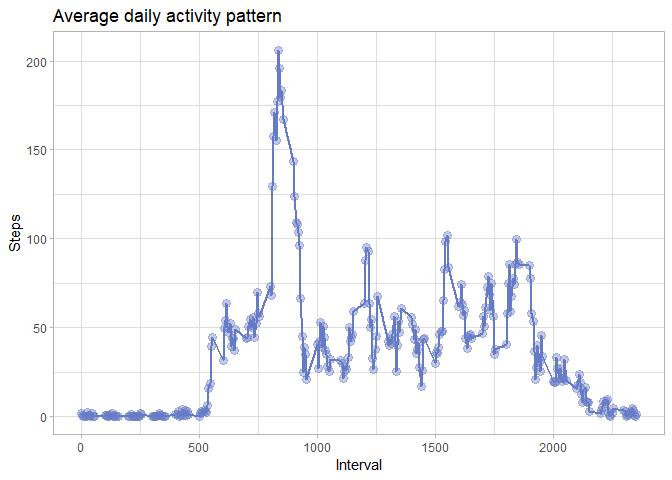
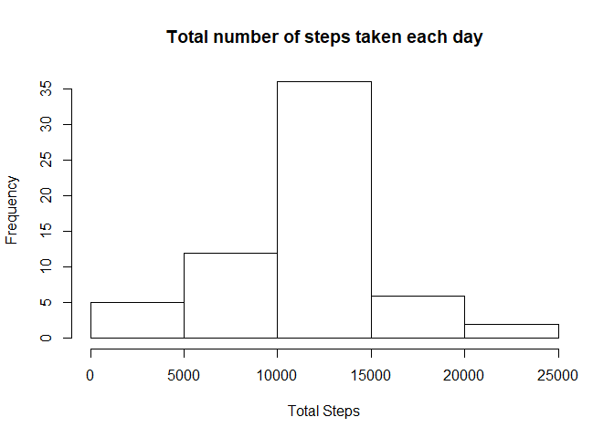
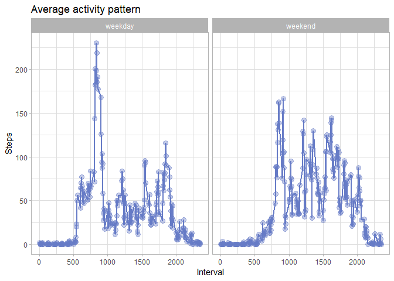

## Loading and preprocessing the data

```r
library(data.table)
library(knitr)
library(kableExtra)
```

```
## Warning: package 'kableExtra' was built under R version 3.4.4
```

```r
library(ggplot2)

activity <- read.table(unz("activity.zip", "activity.csv"), header=T, quote="\"", sep=",")
activity <- data.table(activity)
activity[, steps := as.numeric(steps)]
head(activity)
```

```
##    steps       date interval
## 1:    NA 2012-10-01        0
## 2:    NA 2012-10-01        5
## 3:    NA 2012-10-01       10
## 4:    NA 2012-10-01       15
## 5:    NA 2012-10-01       20
## 6:    NA 2012-10-01       25
```


## What is mean total number of steps taken per day?

Below you find stats about the number of steps.

1. Calculate the total number of steps taken per day. The table below shows the first rows.


```r
total_steps_day <- activity[, list(total = sum(steps, na.rm = T)),
                        by = 'date']


kable(head(total_steps_day)) %>%
  kable_styling(bootstrap_options = c("striped", "hover"), full_width = F)
```

<table class="table table-striped table-hover" style="width: auto !important; margin-left: auto; margin-right: auto;">
 <thead>
  <tr>
   <th style="text-align:left;"> date </th>
   <th style="text-align:right;"> total </th>
  </tr>
 </thead>
<tbody>
  <tr>
   <td style="text-align:left;"> 2012-10-01 </td>
   <td style="text-align:right;"> 0 </td>
  </tr>
  <tr>
   <td style="text-align:left;"> 2012-10-02 </td>
   <td style="text-align:right;"> 126 </td>
  </tr>
  <tr>
   <td style="text-align:left;"> 2012-10-03 </td>
   <td style="text-align:right;"> 11352 </td>
  </tr>
  <tr>
   <td style="text-align:left;"> 2012-10-04 </td>
   <td style="text-align:right;"> 12116 </td>
  </tr>
  <tr>
   <td style="text-align:left;"> 2012-10-05 </td>
   <td style="text-align:right;"> 13294 </td>
  </tr>
  <tr>
   <td style="text-align:left;"> 2012-10-06 </td>
   <td style="text-align:right;"> 15420 </td>
  </tr>
</tbody>
</table>

2. If you do not understand the difference between a histogram and a barplot, research the difference between them. Make a histogram of the total number of steps taken each day.


```r
png("figure/hist1.png", width=480, height=480)

hist(total_steps_day$total, ylab = 'Frequency', xlab = 'Total Steps', 
     main = 'Total number of steps taken each day')

dev.off()
```

```
## png 
##   2
```

```r
hist(total_steps_day$total, ylab = 'Frequency', xlab = 'Total Steps', 
     main = 'Total number of steps taken each day')
```

<!-- -->

3. Calculate and report the mean and median of the total number of steps taken per day


```r
stats <- total_steps_day[, list(mean = mean(total, na.rm = TRUE),
                                median = median(total, na.rm = TRUE))]

kable(stats) %>%
  kable_styling(bootstrap_options = c("striped", "hover"), full_width = F)
```

<table class="table table-striped table-hover" style="width: auto !important; margin-left: auto; margin-right: auto;">
 <thead>
  <tr>
   <th style="text-align:right;"> mean </th>
   <th style="text-align:right;"> median </th>
  </tr>
 </thead>
<tbody>
  <tr>
   <td style="text-align:right;"> 9354.23 </td>
   <td style="text-align:right;"> 10395 </td>
  </tr>
</tbody>
</table>

## What is the average daily activity pattern?

1. Make a time series plot (i.e. \color{red}{\verb|type = "l"|}type = "l") of the 5-minute interval (x-axis) and the average number of steps taken, averaged across all days (y-axis).


```r
average <- activity[, list(avg = mean(steps, na.rm = T)),
                    by = "interval"]

time_series_plot <- ggplot(data = average, aes(x = interval, y = avg, group = 1)) +
  geom_line(size = 1,  col="#667bc6") +
  geom_point(size = 3, alpha = .4, col = "#667bc6") +
  xlab('Interval') + ylab('Steps') +
  theme_light() +
  ggtitle('Average daily activity pattern')

ggsave(plot = time_series_plot, paste(getwd(), '/figure/time_series_plot.png', sep=''), h=8, w=12, type='cairo-png', dpi=120)

time_series_plot
```

<!-- -->

2. The 5-minute interval which contains the maximum number of steps on average across all the days in the dataset is **1705**.

## Imputing missing values

1. The total number of missing values in the dataset is **2304**.

2. Devise a strategy for filling in all of the missing values in the dataset. The strategy does not need to be sophisticated. For example, you could use the mean/median for that day, or the mean for that 5-minute interval, etc.

The imputation method chosed was the mean for that 5-minute interval.

3. Create a new dataset that is equal to the original dataset but with the missing data filled in.

```r
activity2 <- copy(activity)
activity2[, steps := ifelse(is.na(steps), mean(steps, na.rm = TRUE), 
                            steps),
          by = 'interval']
```

4. Make a histogram of the total number of steps taken each day and Calculate and report the mean and median total number of steps taken per day. Do these values differ from the estimates from the first part of the assignment? What is the impact of imputing missing data on the estimates of the total daily number of steps?


```r
total_steps_day_2 <- activity2[, list(total = sum(steps, na.rm = T)),
                        by = 'date']

png("figure/hist2.png", width=480, height=480)

hist(total_steps_day_2$total, ylab = 'Frequency', xlab = 'Total Steps', 
     main = 'Total number of steps taken each day')

dev.off()
```

```
## png 
##   2
```

```r
hist(total_steps_day_2$total, ylab = 'Frequency', xlab = 'Total Steps', 
     main = 'Total number of steps taken each day')
```

<!-- -->

```r
stats2 <- total_steps_day_2[, list(mean2 = mean(total, na.rm = TRUE),
                                median2 = median(total, na.rm = TRUE))]

kable(stats2) %>%
  kable_styling(bootstrap_options = c("striped", "hover"), full_width = F)
```

<table class="table table-striped table-hover" style="width: auto !important; margin-left: auto; margin-right: auto;">
 <thead>
  <tr>
   <th style="text-align:right;"> mean2 </th>
   <th style="text-align:right;"> median2 </th>
  </tr>
 </thead>
<tbody>
  <tr>
   <td style="text-align:right;"> 10766.19 </td>
   <td style="text-align:right;"> 10766.19 </td>
  </tr>
</tbody>
</table>

There is an impact in the stats after imputing missing values. Now, the new average is 1.151 *%* greater than the orginal data while the median is 1.036 % higher.


## Are there differences in activity patterns between weekdays and weekends?

1. Create a new factor variable in the dataset with two levels – “weekday” and “weekend” indicating whether a given date is a weekday or weekend day.


```r
activity2[, day_type := ifelse(weekdays(as.Date(date)) %in% c('Saturday', 'Sunday'), 'weekend', 'weekday')]
```

2. Make a panel plot containing a time series plot (i.e. \color{red}{\verb|type = "l"|}type = "l") of the 5-minute interval (x-axis) and the average number of steps taken, averaged across all weekday days or weekend days (y-axis). See the README file in the GitHub repository to see an example of what this plot should look like using simulated data.


```r
activity2DayType <- activity2[, list(avg = mean(steps)),
                              by = c('interval', 'day_type')]

panel_plot <- ggplot(data = activity2DayType, aes(x = interval, y = avg, group = 1)) +
 geom_line(size = 1,  col="#667bc6") +
  geom_point(size = 3, alpha = .4, col = "#667bc6") +
  facet_wrap(~ day_type) +
  xlab('Interval') + ylab('Steps') +
  theme_light() +
  ggtitle('Average activity pattern')

ggsave(plot = panel_plot, paste(getwd(), '/figure/panel_plot.png', sep=''), h=8, w=12, type='cairo-png', dpi=120)

panel_plot
```

<!-- -->
